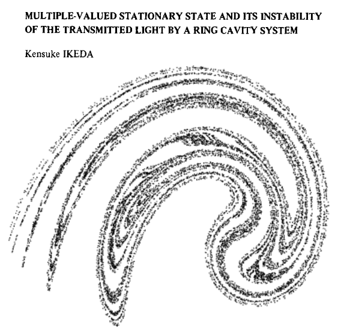
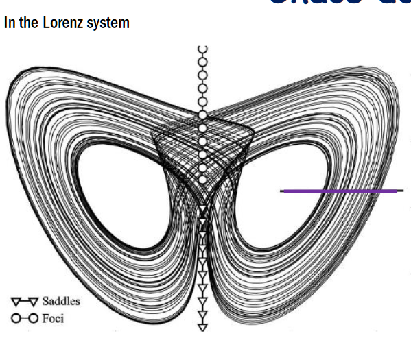

# MAP 551 Dynamical System and Mathematical Modelisation 

MAP551 is a great course at Ecole Polytechnique, during which we are inspecting the properties for some numerical solver for EDP,
stability, bifurcation of dynamical system and influence of parameters in EDP

Furthermore, we have also discovered the chaos system, manifold and other topology of EDP 

    
    
    

----

### Notebook
In the [Notebook](https://github.com/sun-te/MAP551/tree/master/NoteBook) folder, one can find all the jupyter notebook 
to reproduce the principle results that are explained in the reports.  Almost all notebooks are ready to use directly.
However, there are some Notebook that needs to be executed within a `Linux` platform. Since the interaction of python 
with `fortran` might be tedious to be configured on `windows`.

### PC sujet

It, in this folder, contains the questions and description, background and other useful explanation about the notebook and
the excercies

### Report Latex

All source code latex to obtain the pdf report for every ``Petite Classe``

### Report PDF

PDF version for the report corresponding to every course

### bz_1d

This is the source code to reproduce the results for the final project during this course. It is about the numerical solution
for a chemical reaction namely [Belousov–Zhabotinsky reaction](https://en.wikipedia.org/wiki/Belousov%E2%80%93Zhabotinsky_reaction).
This reaction is particularly interesting since it has somehow instability and oscillation. The concentration of several 
chemical materials increases and decreases progressively, which finally demonstrates a colour-varying phenomena. 

In the context of our mini-project, we concentrate mainly on the math property of this reaction. And we are looking for 
different behaviors among several numerical solver for EDP, for example RK45 

